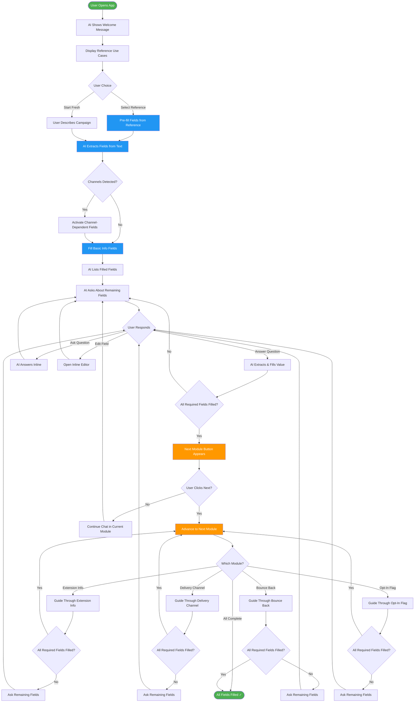
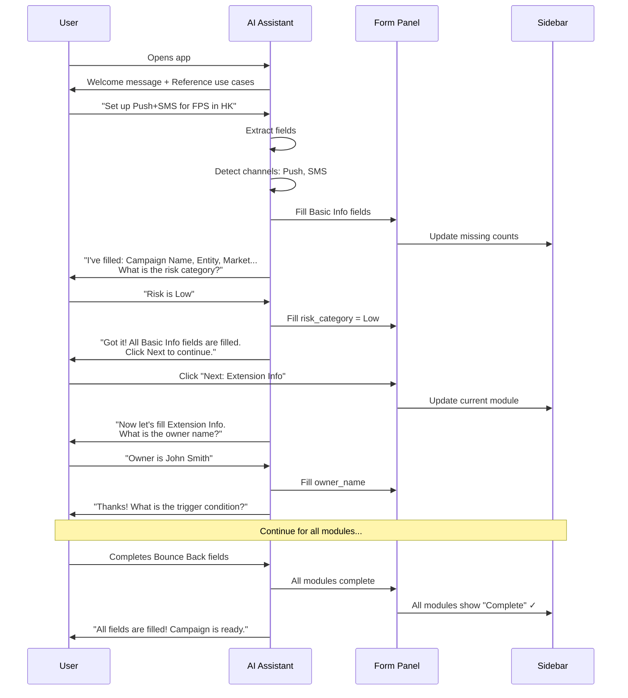
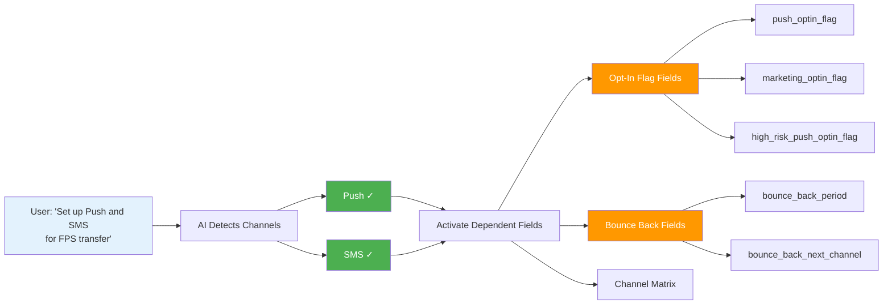

# Campaign AI Assistant - Workflow

## Overview

This document describes the complete workflow for using the Campaign AI Assistant to fill in campaign configuration fields through a guided chat conversation.

---

## Workflow Description

### Step 1: Welcome & Requirement Intake

When the user opens the application, the AI assistant presents a welcome message
explaining its capabilities and prompts the user to describe their campaign requirement.

### Step 2: AI Reference Matching & Field Extraction

The user describes their campaign requirement, for example:
> "信用卡 CNP 高風險交易警示，需要 SMS 和 PUSH，市場 HK"

On the **first** requirement message the app:
1. **Calls `/api/match`** — the LLM scores every historical use case (UC-001..005) 0–100
   against the requirement. If the LLM is unavailable, a deterministic heuristic ranks by
   channel/keyword overlap.
2. **Renders the top matches** as selectable **Reference Use Case** cards (with % scores).

The user can either:
1. **Select a reference use case** → pre-fills the full field set (base values + channel-rule
   fields) and activates the use case's delivery channels
2. **Start fresh** → continue describing; the AI detects channels and extracts field values

### Step 3: Guided Field Completion (Basic Info)

The AI guides the user through remaining Basic Info fields:
- Asks about each unfilled required field
- Answers inline questions (e.g., "What is the risk category?")
- User responds naturally; AI extracts and fills values
- AI continues to the next field automatically

### Step 4: Module Completion & Advancement

When all **required fields** in Basic Info are filled:
- A **"Next Module"** button appears in the form
- User clicks to advance to **Extension Info**
- OR the AI can call `advance_module` to switch automatically

### Step 5: Extension Info Module (Ownership Auto-Populate)

Extension Info captures ownership, hierarchy, schedule, risk and triggering conditions.
Ownership is **auto-populated** from the organizational directory (`users.csv`):
- The user picks a **Message Owner** from the dropdown (or names them in chat)
- The system fills entity, market, line of business, service line, department/team head,
  business lines, business team/contact and cost owner — without overwriting user edits
- **BR-01** is enforced here: if `high_risk_flag = Yes`, `support_dual_vendor` is set to `Yes`

### Step 6: Delivery Channel Module

Configure channel-specific settings:
- Channel priority and routing
- Sender identity and tags
- Traffic strategy
- **Channel Matrix** appears showing selected channels as columns

### Step 7: Opt-In Flag Module

Configure opt-in flags:
- Fields are **conditional** — only relevant if Push/Email channels are selected
- `push_optin_flag`, `marketing_optin_flag`, `high_risk_push_optin_flag`
- Auto-computed based on channel selection

### Step 8: Bounce Back Module

Configure bounce back behavior:
- Fields are **conditional** — only relevant for specific channels
- `bounce_back`, `bounce_back_next_channel`, etc.
- Channel-specific bounce back periods

### Step 9: Completion

When all modules are complete:
- Sidebar shows all modules as "Complete" ✓
- User can review and modify any field
- Modified fields show "Modified" status

---

## User Interactions

| Action | Result |
|--------|--------|
| Free text message | Sent to AI for field extraction |
| Button click (Add/Edit) | Local action, opens inline editor |
| Select reference use case | Pre-fills matching fields |
| Click sidebar module | Scrolls to that module in form |
| "Next Module" button | Advances to next module |
| "Use Samples" dropdown | Selects a sample message to send |

---

## Field States

| State | Description |
|-------|-------------|
| Empty | No value entered |
| AI Prefill | Auto-populated by the assistant (e.g. ownership hierarchy) |
| Reference Prefill | Filled from a selected historical use case |
| Filled | Value entered by AI or user |
| Confirmed | User confirmed the value |
| Modified | User changed a confirmed value |

---

## Business Rules & Validation

The app enforces the BRD §7 rules (see `lib/validation.ts`):

- **Value constraints (VC-01..06)** validate inline in each field row:
  `traffic_percentage` 0–100; `*_bounce_back_period` positive integer minutes;
  `cost_center_id` numeric string.
- **Business rules (BR-01..09)** surface as advisories in the form panel:
  - **BR-01** high-risk → dual vendor (auto-enforced)
  - **BR-02/03/04** traffic-split guidance (high-risk / OTP / standard)
  - **BR-05** bounce-back next channel; **BR-07** regulatory for Servicing;
    **BR-08** PUSH opt-in; **BR-09** line-of-business editable in create only

---

## Module Flow

```
Basic Info → Extension Info → Delivery Channel → Opt-In Flag → Bounce Back
```

Each module must have all **required fields** filled before the "Next Module" button appears. However, users can click any module in the sidebar to jump to it at any time.

---

## Mermaid Diagram



---

## Detailed Module Sequence



---

## Channel Detection Flow


